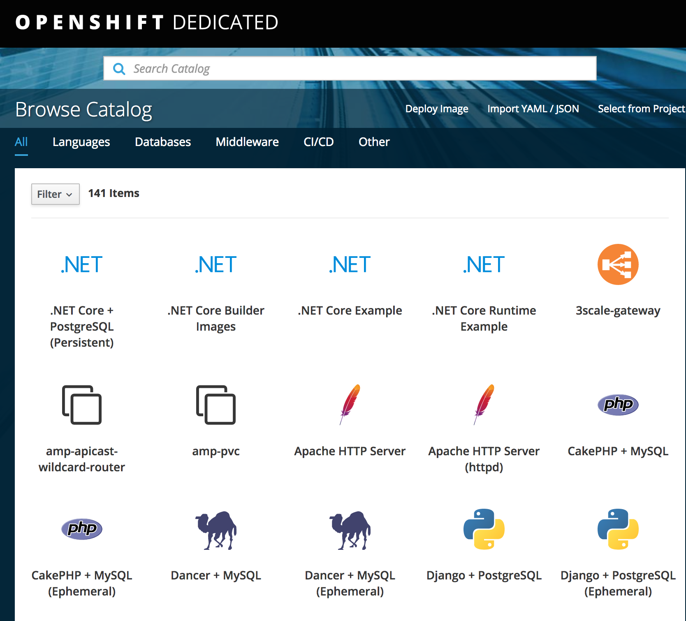

Exercise 0  - Prerequisites
============================

Welcome to the OpenShift Container Platform  workshop! Throughout this session, you will learn about building, deploying, configuring and being productive with the OpenShift Container Platform to manage containerized applications.

## Accessing the Environment

Open up a browser and navigate to the following address:

Once you have successfully authenticated to OpenShift, you will be presented with the OpenShift application catalog.

The catalog streamlines the deployment of applications by providing a user friendly view of the services provided by the platform along with allowing users to build and deploy their own content. We will leverage the catalog later in the lab. 

[Home](../README.md) | [Exercise 1](../exercise1/README.md)
