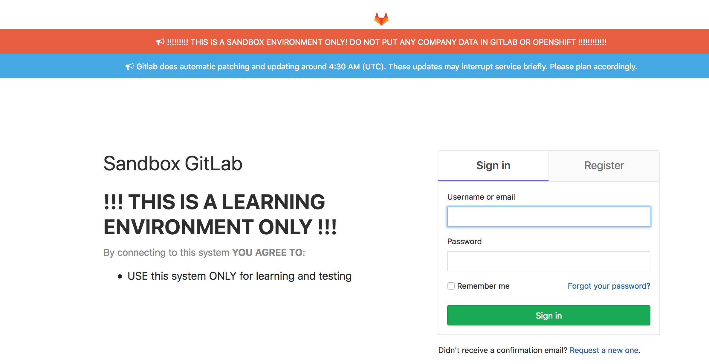

Exercise 0  - Prerequisites
============================

Welcome to the OpenShift Container Platform AppChats workshop! Throughout this session, you will learn about building, deploying, configuring and being productive with the OpenShift Container Platform to manage containerized applications.

## Accessing the Environment

Today's workshop will leverage the XOM Sandbox which is hosted on [OpenShift Dedicated](https://www.openshift.com/products/dedicated/). Access to the environment along with the interaction with the platform will leverage OpenShift browser based [web console](https://docs.openshift.com/container-platform/3.9/architecture/infrastructure_components/web_console.html).

Open up a browser and navigate to the following address:

* [https://console.xom-sandbox.openshift.com/console/](https://console.xom-sandbox.openshift.com/console/)

OpenShift includes a fully functional [Role Based Access Control (RBAC)](https://docs.openshift.com/container-platform/3.9/architecture/additional_concepts/authorization.html) system for managing access to various components of the platform and is backed by authentication providers to govern those who have the ability to access the environment. 

The XOM OpenShift sandbox environment leverages GitLab authentication to manage user access to the environment. 

Enter your username and password to access the OpenShift web console. If you do not have a GitLab account or have forgotten your password, please raise your hand.

Once you have successfully authenticated to OpenShift, you will be presented with the OpenShift application catalog.

The catalog streamlines the deployment of applications by providing a user friendly view of the services provided by the platform along with allowing users to build and deploy their own content. We will leverage the catalog later in the lab. 

[Home](../README.md) | [Exercise 1](../exercise1/README.md)
