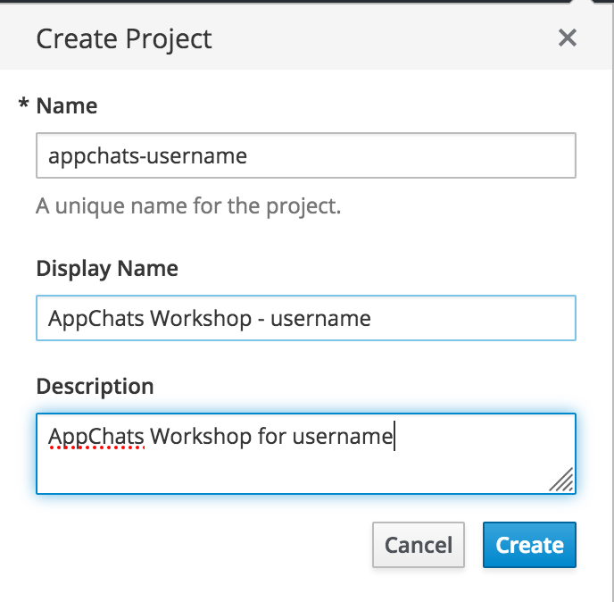
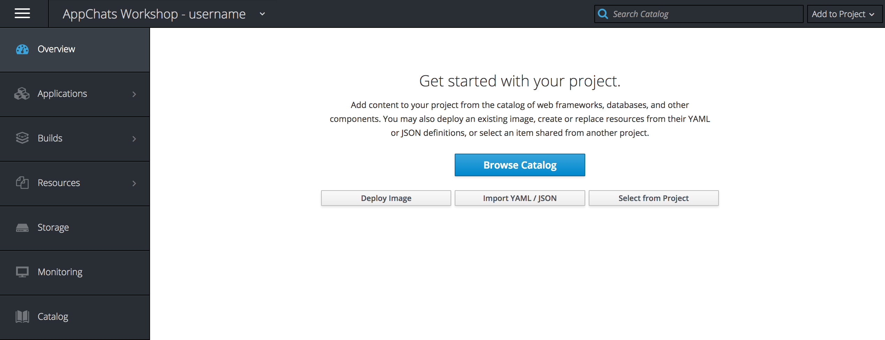
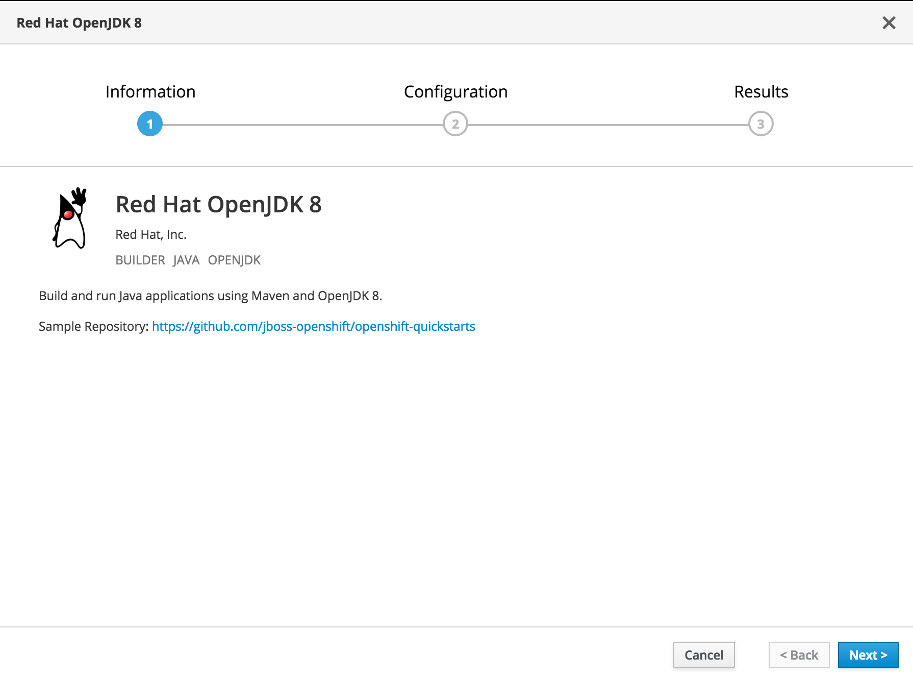
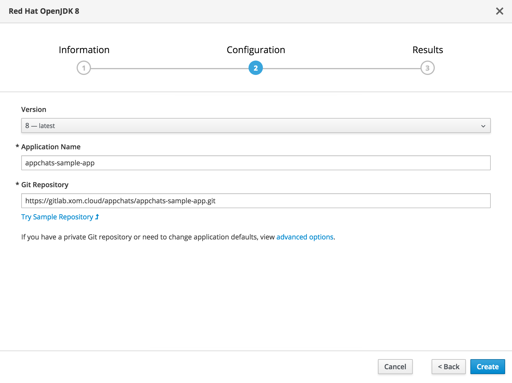

Exercise 1  - Creating an Application
============================

In this exercise, you will learn how to create a container image using source code from an Git repository and deploy the resulting image to OpenShift.

## Creating a Project

Content within OpenShift is primairly organized within [Projects](https://docs.openshift.com/container-platform/3.9/dev_guide/projects.html). A project allows a community of users to organize their resources in isolation from other communities. In this workshop, you will create a project that will you will use to explore the features and functionality of OpenShift.

On the right side of the catalog page, you will see a list of projects that you have access to. Don't worry that none are currently available. We will create a new project for us to utilize. 

To create a new project, locate and _click_ the **Create Project** button on the top righthand corner of the OpenShift catalog page.

To signify your project from other users, utilize the project name _appchats-&lt;USERNAME&gt;_ where you replace the _&lt;USERNAME&gt;_ with the username you used to access the environment. 

Fill in the rest of details in the dialog as shown below

* **Name**: my-&lt;USERNAME&gt;
* **Display Name**: My Workshop - &lt;USERNAME&gt; 
* **Description**:  My Workshop for &lt;USERNAME&gt; 

Once the project has been created, it will appear on the righthand side.

## Build and Deploy an Application

Applications are built and deployed within projects in OpenShift. In this section, we will use the project previously created to build a Spring Boot based application and deploy it to our new OpenShift project.

Once a project has been created, it will appear in the list of other projects that you have access to on the catalog. 

**Click the my-&lt;USERNAME&gt; Project** from the navigation pane to enter the project. 

Once in the project, you will be presented with various options for deploying resources to OpenShift along with a navigation bar on the lefthand side. We will navigate through the various options in a subsequent exercise.

**Click the Browse Catalog** button to explore the various resources that can be deployed to OpenShift. These are also organized by category at the top of the page to simplify locating the item to utilize.

### Methods for Building a new container image

One of the benefits of OpenShift is that is is a fully featured container build platform. You, as a user, do not need to worry about the low level details of building a container image. 

OpenShift supports a number of for building container images:

* Docker
	* Invokes the [docker build](https://docs.docker.com/engine/reference/commandline/build/) command to create a new image from an existing _Dockerfile_
* Source-to-Image (S2I)
	* Tool for simplifying the creation of container images by injecting source code into an exiting image
* Pipeline
	* Utilization of [Jenkins pipelines](https://jenkins.io/doc/pipeline/) to implement CI/CD methodologies

These strategies can be sourced from a variety of locations:

* Git repository
* Inline Dockerfile
* Existing binary artifact

A full list of build strategies and inputs can be found [here](https://docs.openshift.com/container-platform/3.9/dev_guide/builds/index.html).

### Sample Spring Boot Application

One of the most popular frameworks for microservices style applications using Java is [Spring Boot](https://spring.io/projects/spring-boot). Spring Boot allows for the creation of a single artifact (.jar [Java artifact] file) which can be executed and run. An entire web server, such as Apache Tomcat, is not needed but instead is embedded within the Spring Boot application. 

The sample application for the workshop is located within the following Git repository. 

[https://github.com/RedHatWorkshops/spring-sample-app](https://github.com/RedHatWorkshops/spring-sample-app)

The application provides a number of mechanisms that will help showcase some of the key qualities of container/microservices based architectures along with how they can be implemented within OpenShift. 

### Building and Deploying the Sample Application

To create the new container image, we will be utilizing the [Source-To-Image (S2I)](https://docs.openshift.com/container-platform/3.9/using_images/s2i_images/index.html) build strategy as described previously along with content from the Git repository. S2I drastically simplifies the process for creating container images. Users do not need to be concerned about the process of building images. They just provide source code and go!

Let's go ahead and create a new Java application. From the catalog, select the **Languages Tab** and then select **Java**.

Locate **Red Hat OpenJDK 8** which will launch a new wizard for creating and deploying an application. 

Select **Next**

Enter the following configuration values in the fields provided:

* **Application Name**: myspring-sample-app
* **Git Repository**: https://github.com/RedHatWorkshops/spring-sample-app.git

A variety of options are available when creating any new application, select the **advanced options** to view them.

Review all of the options available. None of the default values require reconfiguration at this time. 

Verify that the checkbox next to _Create a route to the application_ under the _Routing_ section is checked. This will allow for the application to be available in a web browser. 

Scroll to the bottom of the page and select the **Create** button. 

A message should indicate that the _appchats-sample-app_ application has been created. 

Click the _Continue to the project overview_ to return to the overview page.

In the next exercise, we will review what was created when we created the sample application and browse around the features of the OpenShift Web Console. 

[Exercise 0](../exercise0/README.md) | [Home](../README.md) | [Exercise 2](../exercise2/README.md)
