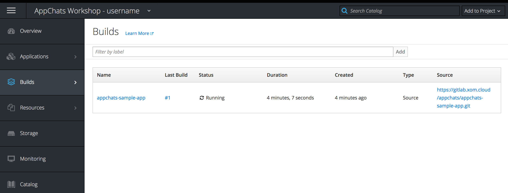
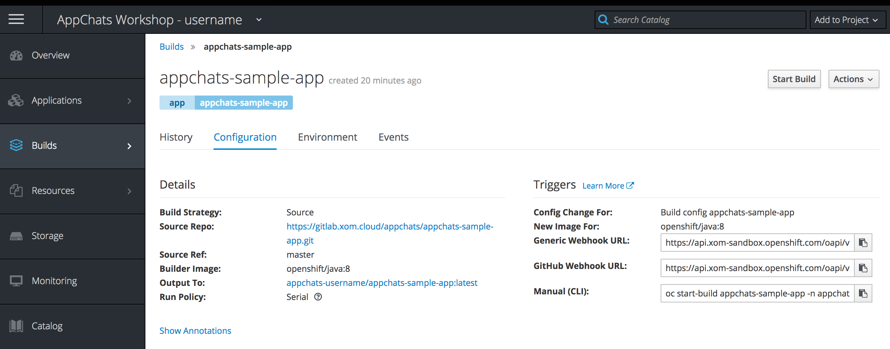
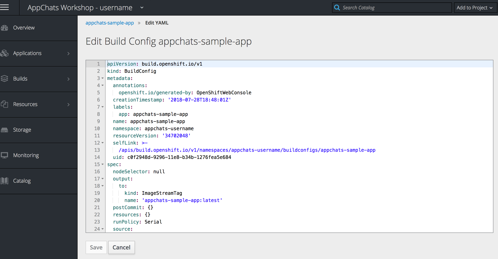
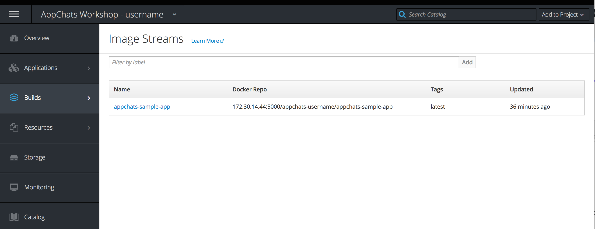
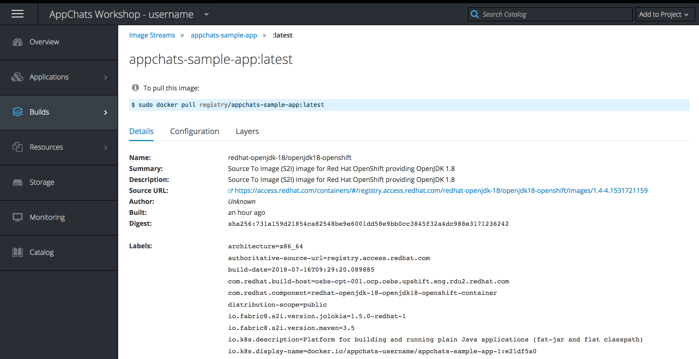
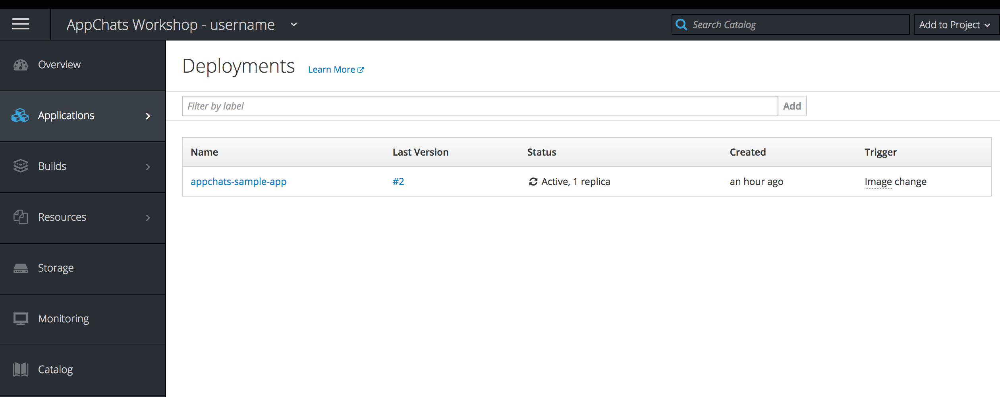
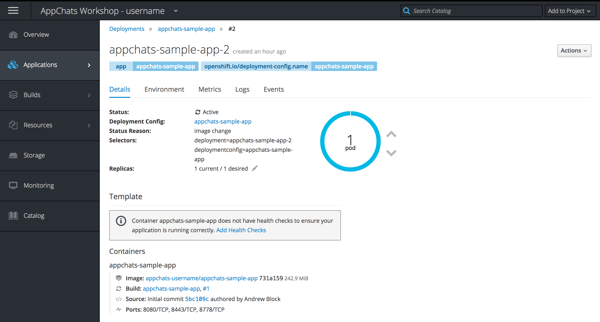

Exercise 2  - Exploring the OpenShift Web Console
============================

In this exercise, you will verify the resources that were previously instantiated when creating the sample application along with exploring the features provided by the OpenShift web console. 

## Verify the Build and Deployment of the Sample Application

When creating an application from source code in the OpenShift web console, it triggered the start of a two step process

1. Build a new container image
2. Deploy the image as a running container

The OpenShift Container Platform contains a number of resources within its' ecosystem. These resources are stored in an [etcd](https://github.com/coreos/etcd) database included within the cluster which can be viewed and manipulated in the web console. Each of these resources can be seen within the locations in the web console. 

As described earlier, the first step in the new application process is the creation of a new container image. The creation of the image is facilitated through a _Build_ process. Builds in the OpenShift Web Console can be seen on the _Builds_ page by hovering over the _Builds_ button on the lefthand navigation bar and then selecting **Builds**. 

A new build called _appchats-sample-app_ was created and as you can see, it will either have a status of _Running_ or _Complete_. **Select** the _appchats-sample-app_ link underneath the _Name_ column within the included table.

Select the **Configuration** tab to view the configuration for the build:

All of the details of the build process including the location of the Git repository, base image and build strategy are all found on this page. 

The user interface provides a representation of the underlying object within OpenShift storing the configuration for the build. This object is known as a `BuildConfig`. The raw source of this object can be seen by clicking on the *Actions** dropdown and **Edit YAML** button. 

Click the **Cancel** button to return to the prior page.

Click on the **History** tab and view the logs from the first build by clicking the **View Log** button.

As you browse through the log, you will notice see the process of creating a new image using the S2I process: 

1. Clone source code from Git
2. Perform Maven based build of the source code
3. Commit the contents into a new image
4. Push the image to a registry located within the OpenShift platform

Once the build completes, at the end of the logs, you should see the lines "Push successful" which indicates a new image has been created. Confirm this on the _Images_ page by clicking **Builds** -> **Images**

By default, newly created images will have the _latest_ tag. A tag is an alias to the underlying ID of the image in a human readable form. 

Click on the **appchats-sample-app** and then the **latest** button under the _Tag_ column to display details about the newly created image.

When an image is pushed to the registry, a deployment of the application is automatically started. Deployments can be viewed on the _Deployments_ page by hovering over the **Application** button on the lefthand navigation pane and then selecting **Deployments**.

The deployments page will show all deployments and their current status. Notice how the deployment was triggered by an _Image Change_ as noted under the _Trigger_ column.

The _Status_ column shows the current state of the application. It shows that 1 replica of the application is currently running.

Click on the **appchats-sample-app** link to view a history of all deployments.

Similar to Builds, there is an underlying API object known as a _DeploymentConfig_ that defines  how an application should be deployed and run. Take a moment to view the underlying configuration for the DeploymentConfig by selecting **Actions** and then **Edit YAML**.

When you are done, select **Cancel** to return to the prior page.

We will utilize many of the areas of the deployments section throughout the remainder of the workshop.

Now, select the link underneath top most number underneath the Deployment column which has a status of _Active_ to view the currently running application

Notice how 1 _Pod_ is running. A [pod](https://docs.openshift.com/container-platform/3.9/architecture/core_concepts/pods_and_services.html#pods) is the smallest compute unit defined in OpenShift and represents one or more containers grouped together on a single host. A pod contains the configuration of how to run the application. 

In the next exercise, we will confirm the application is accessible in a web browser and configure the application to be available via a secure HTTPS transport protocol.

[Exercise 1](../exercise1/README.md) | [Home](../README.md) | [Exercise 3](../exercise3/README.md)