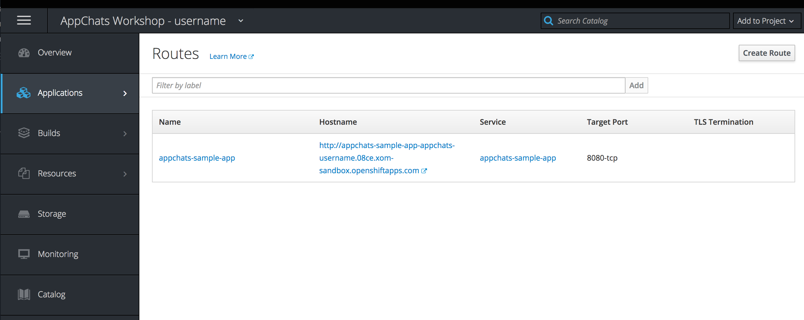
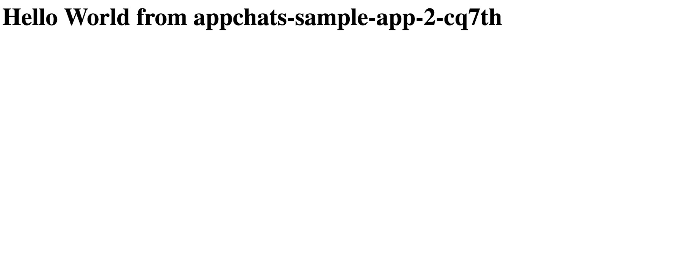
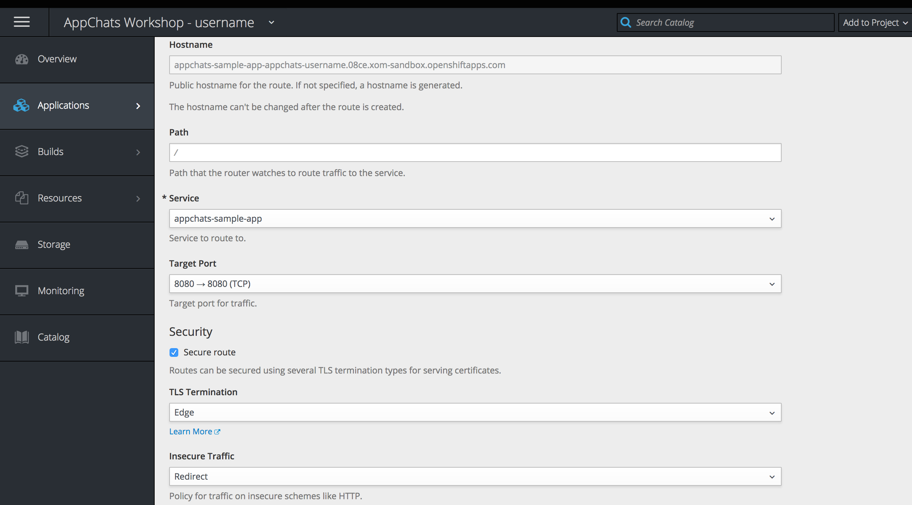
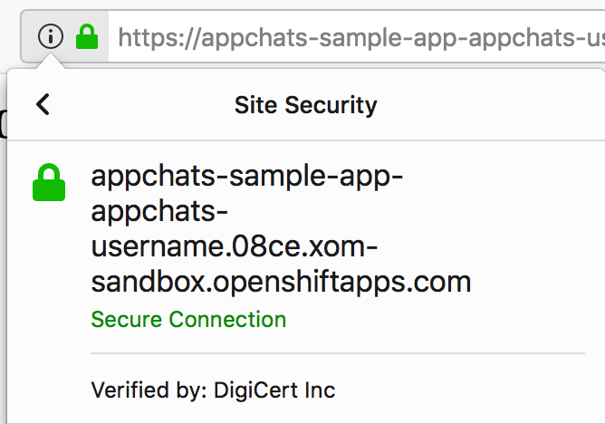

Exercise 3  - Routing
============================

In this exercise, you will view the previously deployed application in a web browser and see how easy it is to configure the application to be exposed via SSL. 

## Viewing the Application in a Web Browser

The sample spring boot application exposes a number of HTTP endpoints which are viewable in a web browser. When using the OpenShift web console to build and deploy an application from the catalog, and the option to expose the running container outside the cluster is selected, a [Route](https://docs.openshift.com/container-platform/3.9/dev_guide/routes.html).

A route is connected to another object in OpenShift called a [Service](https://docs.openshift.com/container-platform/3.9/architecture/core_concepts/pods_and_services.html#services). A service can be thought of as an internal Load Balancer among multiple related pods. 

One of the benefits of OpenShift is that multiple replicas of an application can be created to ensure high availability. A service is used to communicate with either of these pods as they are created and destroyed. A route utilizes a services to reference the location of the underlying pods and containers. 

Routes are located within the OpenShift web console by hovering over **Applications** and then selecting **Routes**.

As you can see, the _appchats-sample-app_ route uses the _appchats-sample-app_ and has a reference to the _8080-tcp_ port exposed by the pod. 

**Click** on the URL underneath the _Hostname_ which will open the application in a browser.

The output prints out the hostname of the container running the application. This name is inherited by the name of the pod and can be verified by hovering over the **Applications** tab on the navigation page and selecting **Pods**.

## Securing the Application via SSL

Applications exposed using Routes leverage a router included within the OpenShift cluster and allow for traffic via ports 80 and 443 using HTTP/HTTPS protocols or applications that support Server Name Indication (SNI). Even though only ports 80 and 443 are exposed via the OpenShift router, the backend applications running as containers can expose traffic using alternate ports. The mapping of ports can be configured on the service.

Currently, the sample application is exposing traffic via plain HTTP on port 80 through OpenShift's router. To increase security, we can configure our application to be served via HTTPS and leverage an SSL certificate provided by the platform. 

Once again, revisit the Routes page by hovering over **Applications** and then selecting **Routes**.

Select the *appchats-sample-app* route to show the details. Notice how under the _TLS Settings_ section it states that TLS is not enabled. Click **edit** to modify the configuration of the route.

Enable SSL by selecting the **Secure route** underneath the _Security_ section. 

Confirm **Edge** is selected in the _TLS Termination_ dropdown along with selecting **Redirect** in the _Insecure Traffic_ dropdown. The redirect option will automatically redirect requests to the HTTPS protocol for requests made using standard HTTP.

Select **Save** at the bottom of the page to apply the configuration.

If the sample application is still open in another browser tab, refresh the page. Otherwise, select the hyperlink as presented on the route overview page.

Notice how the url now uses HTTPS and the application is secure via a valid SSL certificate.

 
 
With only a few steps, the application is secured via SSL!

[Exercise 2](../exercise2/README.md) | [Home](../README.md) | [Exercise4](../exercise4/README.md)