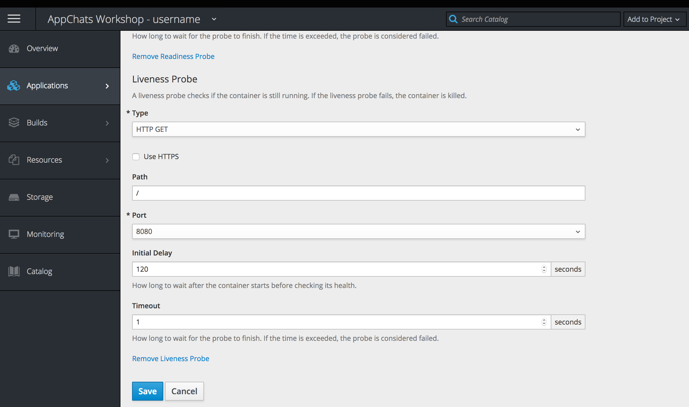

Exercise 4  - Monitoring the Application
============================

In this exercise, you will explore various ways to monitor the health of an application

## Overview

Once an application is deployed, the next major consideration is how to track the current and historical status. OpenShift contains a number of features and components to aid in this area of focus. 

* Pod Logs
* Aggregated logs
* Metrics
* Events and Project Level Monitoring

In addition, you can also configure OpenShift to monitor the ongoing health of the application which will determine whether it is available for consumption. 

## Pod Logs

Many cloud native application follow a set of principles known as the the [Twelve-Factor App](https://12factor.net/). We will see several of the principles employed by the Twelve-Factor App throughout the remainder of the workshop.

The first Twelve-Factor App principle that we cover is that all output should be written to `stdout` instead of a file. With logs written to standard out, we can view and capture the output. 

Applications logs can be viewed in the web console in each running Pod. 

Navigate to the running pod by hovering over **Applications** button, select **Pods**, and finally select the name of the _Running_ pod. 

Application logs are found on the **Logs** tab.

## Log Aggregation

While being able to view an individual pod log in the web console is great, there are a few issues at hand:

* Multiple pods for a given service may be active thus only providing a partial view of the overall application
*  Pods can be created and deleted resulting in the loss of persistent logs

To solve this issue, OpenShift includes an [aggregated logging framework](https://docs.openshift.com/container-platform/3.9/install_config/aggregate_logging.html) based on Elasticsearch, Fluentd and Kibana (EFK). To access the Kibana console, scroll to the top of the _Logs_ tab for a pod and select **View Archive**. 

The Kibana console only gives you access to the logs from the applications for which you have access to. Perform a few queries to test out the functionality of the console.

## Metrics

OpenShift captures application level metrics and exposes them within the OpenShift web console. Metrics can be viewed either at a pod level or can be seen as an aggregation of multiple pods underneath a given deployment. 

First, view metrics at a pod level by once again revisiting the running pod for the _
appchats-sample-app_ application. If still in the Kibana console, click on the **Back** link on the top lefthand corner of the page. Otherwise, once again navigate to the running pod by hovering over **Applications** button, select **Pods**, and finally select the name of the _Running_ pod.

Select the **Metrics** tab where you can view CPU, memory, and network telemetry for the pod. 

The timeframe can also be expanded using the Time Range dropdown which will show the available set of metrics for the range defined. 

In addition to pod level metrics, metrics for a deployment for averaged among all running pods on the project overview page. Click on the **Overview**  button on the navigation bar and then expand the _appchats-sample-app_ application. 

## Project Level Monitoring

Finally, an aggregated view of logs from builds, pods, and deployments as well as event notifications are available on the _Monitoring_ tab of the web console. Click the **Monitoring Tab** on the navigation bar to view the features provided  on this page.

## Application Health

During the lifespan of an application, certain components can become unhealthy for a variety of reasons, such as network connectivity or configuration error. Fortunately, OpenShift has a number of built in mechanisms to monitor applications and determine whether they are healthy. This is a fundamental piece of OpenShift's functionality to maintain the state of applications running on the platform.

### Probes

OpenShift will periodically perform diagnostics on a running container through the use of _**probes**_. Two (2) types are currently supported:

| Type | Description |
| ------ | --------------- |
| Liveness Probe | Checks if the container for which it was configured for is still running. If the probe fails, the container is killed which will result in a new container (Depending on the `restartPolicy` of the Pod) |
| Readiness Probe |  Determines whether the container is ready to service requests. If the probe fails, the endpoint will be unregistered from the service and result in traffic no longer being able to reach the container. |

It is important to note that there is a clear distinction between the two types of probes. A _Readiness Probe_ will determine whether traffic can reach the container while a _Liveness Probe_ will determine whether the container should remain active in its current state.

There are three methods in which probes can be configured:

| Type | Description |
| ------ | -----------------|
| HTTP | Web hook executed from the node the container is running on. The check is deemed successful if the response code is between 200 and 399 |
| Container Execution | Command is executed within the container by the node. The check is deemed successful if the exit code is 0. |
| TCP socket | A socket connection is attempted against the container. The check is deemed successful if a connection is established. |

### Configuring Application Health Checks

Many application frameworks are now designed with providing insight into the overall application health. Spring Boot, the framework the sample application is written contains functionality through [endpoints](https://docs.spring.io/spring-boot/docs/current/reference/html/production-ready-endpoints.html) for displaying application health. This capability is enabled within the sample application and exposed at the `/healthz` context. 

You can view the health check in action within your browser by navigating to the application as and adding `/healthz` at the end until you have a URL similar to _http://appchats-sample-app-appchats-&lt;USERNAME&gt;.08ce.xom-sandbox.openshiftapps.com/healthz_

While the output display is fairly basic, it provides the all the information that OpenShift needs for it to be able to determine that the application is healthy.

Health checks are configured within the _Deployments_ section of the OpenShift web console. Navigate to the Deployments page by hovering over the _Applications_ button on the lefthand navigation bar and then select **Deployments**. Select **appchats-sample-app** to display the details for the application.

Select **Actions** on the top right side of the page and then **Edit Health Checks**. 

Both Liveness and Readiness probes can be defined within this page. Let's go ahead and add both a liveness and readiness probe for the sample application.

First, add a Readiness Probe by selecting the **Add Readiness Probe** link.

Since our sample application exposes an HTTP endpoint for displaying application health, be sure the _type_ dropdown specifies **HTTP Get**

Enter **/healthz** for the context path containing the health check

All of the exposed ports for the container are described in the _Port_ dropdown. Since HTTP based traffic utilizes port **8080** by default, make sure that it is selected

An _Initial Delay_ indicates the amount of time that OpenShift waits before starting the probe. It is important to try to pick a value higher than the shortest time an application will ever be available. Since spring boot applications take a few seconds to fully become ready, we can safely choose **5** as the value. 

The default value of **1** for _Timeout_ is acceptable and does not require modifications.

Now, add the liveness probe by selecting the **Add Liveness Probe** link.

Many of the same values that were configured in the Readiness Probe can be used in the Liveness Probe. The only difference is the _Initial Delay_.

Recall that a liveness probe will kill a container when it has determined that it is no longer healthy. To avoid the container from unintentionally being killed as it starts up, a value should be provided that exceeds the normal startup time. 

Set **120** as the value for the _Initial Delay_. 

_Note:_ This value was set intentionally high due to the limited resources in the lab environment.

Copy the remaining items from the values specified in the Readiness Probe.

Click **Save** to apply the health checks to the application.

Since a change was made to the configuration, a new version of the application will be rolled out. You can see this in action by clicking on the **Overview** button on the lefthand navigation bar.

The existing pod is indicated on the lefthand side with the dark blue circle indicating that it is ready and actively receiving traffic. On the righthand side is the new version of the application. If a light blue circle encompasses the pod, it indicates that it has yet to pass its' health check. Once the health check passes, the circle will turn dark blue and the original version of the application will be scaled down. 

One of the benefits of leveraging health checks that it aids in the availability of applications during upgrades or rollouts. This is in due part to the [_Deployment Strategy_](https://docs.openshift.com/container-platform/3.7/dev_guide/deployments/deployment_strategies.html) that is being utilized.

Two deployment strategies are available in OpenShift:

* [Recreate](https://docs.openshift.com/container-platform/3.7/dev_guide/deployments/deployment_strategies.html#recreate-strategy) - Scales down the existing application to zero replicas before rolling out the new version. Downtime will occur during this strategy
* [Rolling](https://docs.openshift.com/container-platform/3.7/dev_guide/deployments/deployment_strategies.html#rolling-strategy) - Slowly replaces old versions of an application with new versions. This strategy will wait for new pods to become _ready_ based on the _Readiness Check_.

A third _custom_ strategy is also available for those wanting full control of the deployment process, however it is infrequently used.

The Deployment Strategy being used can be verified for the sample application by once again navigating to the Deployments page by hovering over the _Applications_ button on the lefthand navigation bar and then select **Deployments**. Select **appchats-sample-app** to display the details for the application.

Select **Actions** on the top right side of the page and then **Edit**. The details for the deployment strategy will be displayed.

Finally, let's confirm that the sample application is always available even as a new version is deployed. 

If still on the "Edit Deployment Config" page, select **Cancel** to return to the deployments page for the sample application.

Once on the Deployment page, click the **Deploy** button on the top righthand side of the page. This will trigger a new rollout.

After the application deployment has been initiated, click on the **Overview** button on the lefthand navigation bar. You should notice once again both the existing version as active along with the new version in a not ready state as it awaits the validation of the Readiness check. 

Confirm the application is still available by selecting the link for the application next to the name of the application. The continuous availability of applications with minimal configurations is another benefit to the functionality provided by OpenShift.   

In the next exercise, we will demonstrate various methods in which the application can be configured.

[Exercise 3](../exercise3/README.md) | [Home](../README.md) | [Exercise5](../exercise5/README.md)
