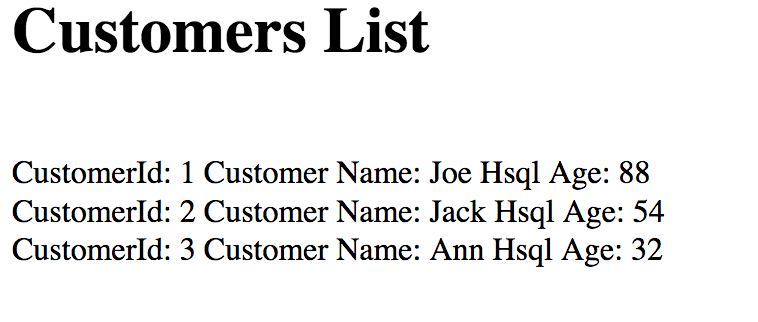

Exercise 5  - Methods for Managing Application Configurations
============================

In this exercise, you will learn various methods that application configurations can be managed within the OpenShift Container Platform and be introduced to a use case that will emphasize these concepts.

## Overview

Many applications utilize configurations to drive the behavior and functionality. Spring Boot based applications, along with AppChats sample application, provide mechanisms for injecting values into the application. These types of configurations can vary per environment, such as from development to staging and finally into production. 

To promote application portability, it is recommended that configuration values be externalized outside of the application itself. In the case of Spring Boot applications, a base default set of configurations can be packaged in the application and overridden at runtime in each deployment environment.   

## Methods for Managing Application Configurations Within OpenShift

One of the principles of Twelve-Factor application is [config](https://12factor.net/config) where it promotes a strict separation of configuration and source code. This separation allows for values to not only be externalized from the application, but also stored within the platform. OpenShift supports storing these configurations in a variety of mechanisms where they can then be injected into the application. These include:

* [ConfigMaps](https://docs.openshift.com/container-platform/3.9/dev_guide/configmaps.html) - Configuration data which can be used to store fine-grained information such as individual properties or coarse-grained information such as entire configuration files
* [Secrets](https://docs.openshift.com/container-platform/3.9/dev_guide/secrets.html) - Holds sensitive information, such as passwords. Properties are stored in a base64 encoded format within the platform.
* Raw environment variables - Key/value pairs

The values contained within each of these mechanisms can be injected as Operating System environment variables, or mounted as volumes within the file system of the application. 

## Use Case Within the Sample Application

To demonstrate the utilization of externalized properties within OpenShift, the AppChats sample application contains the functionality to perform a database lookup. The application by default leverages a properties file called  `application.properties` located in the `src/main/resources` folder containing the following values:

```
spring.datasource.platform=hsqldb
spring.datasource.url= jdbc:hsqldb:file:/home/jboss/mydb;shutdown=true 
spring.datasource.username=user
spring.datasource.password=password
```

The persistence layer is backed by an [HSQL](http://hsqldb.org/) in database. The endpoint `/dbtest` is exposed by the application to query the database

Navigate to the following location replacing &lt;USERNAME&gt; with your individual username:

[https://appchats-sample-app-appchats-&lt;USERNAME&gt;.08ce.xom-sandbox.openshiftapps.com/dbtest](https://appchats-sample-app-appchats-&lt;USERNAME&gt.08ce.xom-sandbox.openshiftapps.com/dbtest) 

The following is displayed:



The last name of each customer contains the backing persistent store (Hsql in this case). 

When the application first starts up, the HSQL database is initialized with the following set of data:

* [schema-hsqldb.sql](https://gitlab.xom.cloud/appchats/appchats-sample-app/blob/master/src/main/resources/schema-hsqldb.sql) - Create the database schema
* [data-hsqldb.sql](https://gitlab.xom.cloud/appchats/appchats-sample-app/blob/master/src/main/resources/data-hsqldb.sql) - Seeds the database

To demonstrate how to leverage the various methods for defining application configurations within OpenShift, we will make modifications to leverage a MySQL database as a persistent store instead of the default HSQL in the next few exercises. 

[Exercise 4](../exercise4/README.md) | [Home](../README.md) | [Exercise 6](../exercise6/README.md)
