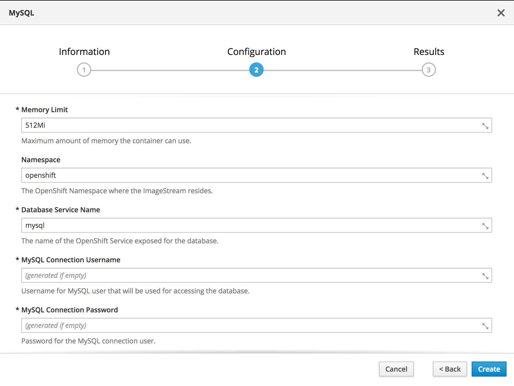

Exercise 6  - Deploying a MySQL Database
============================

In this exercise, you will deploy a [MySQL](https://www.mysql.com/) database to support the AppChats sample application.

## Databases on OpenShift

OpenShift supports the deployment of [databases](https://docs.openshift.com/container-platform/3.9/using_images/db_images/index.html) images on the platform. The OpenShift Catalog contains a number of popular database technologies including [PostgreSQL](https://docs.openshift.com/container-platform/3.9/using_images/db_images/postgresql.html), [MongoDB](https://docs.openshift.com/container-platform/3.9/using_images/db_images/mongodb.html) and [MySQL](https://docs.openshift.com/container-platform/3.9/using_images/db_images/mysql.html).  The integration through the catalog allows the developer the ability to quickly add these technologies to their application.

## Deploying a MySQL Database

Deploy an instance of MySQL to your project by first selecting the **Add to Project** button at the top right corner of the of the web console and then selecting **Browse Catalog**

Select the **Database** category at the top and then select the **MySQL** tile.

Two deployment options are available: _MySQL_ and _MySQL (Ephemeral)_. The MySQL option will allocate persistent storage for the database so that in the event the pod running the database is destroyed, data will still be preserved. Any new MySQL pod will reattach to the preexisting storage. 

Select **MySQL**

You are presented with a dialog wizard that provides an overview of the contents that will be deployed. Select **Next** to view the _Configuration_ page.

A variety of options are available which _can_ be configured. Fortunately, the defaults can be utilized without any additional configuration. The username and password for MySQL will be automatically generated and configured in the database during the initial startup.

Scroll down to the bottom of the page and select **Create** to instantiate the MySQL database.

An overview of the items created including the username, password and database will be displayed. It is not necessary that these values be captured. Click **Close** to complete the dialog wizard.

Click the **Overview** button on the lefthand navigation bar and then locate the _mysql-persistent_ application. 1 running pod indicates the successful deployment of the MySQL database.

In the next exercise, we will utilize the application configuration options provided by OpenShift to make use of the newly deployed MySQL database.

[Exercise 5](../exercise4/README.md) | [Home](../README.md) | [Exercise 7](../exercise7/README.md)