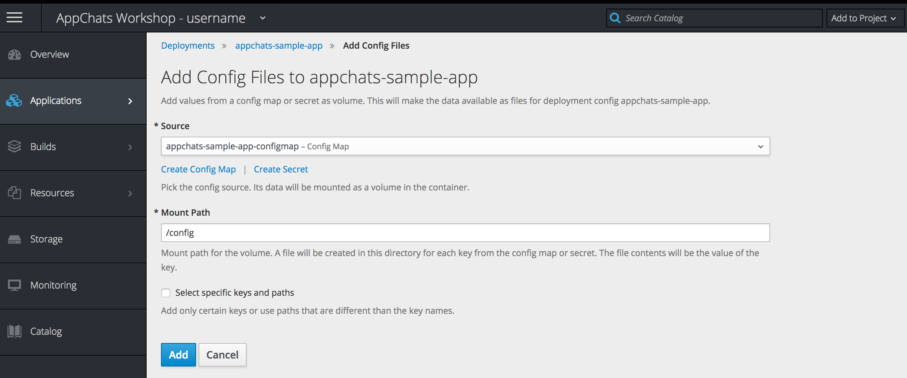

Exercise 7  - Secrets, ConfigMaps and Environment Variables
============================

In this exercise, you will use the various forms of application configuration types within OpenShift to update the AppChats sample application to leverage MySQL as the backend persistent layer.

## Secrets

Applications typically make use of sensitive values with the most common use case being passwords. OpenShift supports storing sensitive values within the platform as [Secrets](https://docs.openshift.com/container-platform/3.9/dev_guide/secrets.html). Values stored within secrets are base64 encoded and provide a baseline method for managing sensitive values.

In the prior exercise, you deployed a MySQL database to your project. As part of the deployment, the values from a portion of the configuration dialog were stored in the platform as a Secret. These include the following items:

* Username and password for the regular MySQL user
* Username and password for the MySQL admin user
* Name of the database created

Secrets can be seen on the OpenShift web console by hovering over the **Resources** tab and then selecting **Secrets**. 


The secret that was created as part of the deployment is called _mysql_. You will also notice other secrets defined as well. These are associated to OpenShift [Service Accounts](https://docs.openshift.com/container-platform/3.9/dev_guide/service_accounts.html) that are created by default with any new project. Service Accounts will not be covered during this workshop.

**Click** the _mysql_ secret


The properties stored in the secret are displayed. You can choose to view the values defined in each secret by selecting the _Reveal Secret_ link. 

### Inject Secret Values as Environment Variables

As mentioned in a prior workshop, values stored in secrets can be exposed to applications as either environment variables or as files within the container. Let's configure a portion of the properties defined within the secret as environment variables within the AppChats sample application.

Navigate to the _appchats-sample-app_ deployment by hovering over **Applications**, selecting **Deployments** and then selecting **appchats-sample-app**.

Environment variables which are injected into the application can be configured on the _Environment_ tab. Select **Environment** to configure the environment variables. 


Environment variables can be defined either as raw key/values or take in values from ConfigMaps or Secrets. 

Since the properties that we are concerned about are stored in the _mysql_ secret, lets inject a portion of those values into our application. 

Under the *appchats-sample-app* container, select **Add Value from Config Map or Secret**. Enter **MYSQL_DATABASE** in the textbox. In the _resource_ dropdown, select **mysql**. In the _key_ dropdown, select **database-name**.

This process will need to be repeated two more times to add the username and password of the mysql database. Use the following table for reference for the items that need to be created.

| Environment Variable Name | Resource Dropdown Value | Key Dropdown Value |
| ------------------------------------ | ------------------------------------ | ---------------------------- |
| MYSQL_DATABASE | mysql | database-name |
| MYSQL_USER | mysql | database-user |
| MYSQL_PASSWORD | mysql | database-password | 

Once complete, the values should appear similar to the image below:


Click **Save** to apply the configuration.

When a configuration change is made, the application is set to rollout the application for the values to take effect. 

## Use A ConfigMap to Define a New Spring Boot Properties File

Now that the details to connect to the MySQL database are available in the container, we can now override the default Spring Boot `application.properties` file which will allow for the application to use MySQL instead of HSQL as the database using a [ConfigMap](https://docs.openshift.com/container-platform/3.9/dev_guide/configmaps.html). 

The management of ConfigMaps can be facilitated entirely within the OpenShift web console by hovering over **Resources** and then selecting **Config Maps**.

Create a new ConfigMap by selecting the **Create ConfigMap** button.

Enter the name **appchats-sample-app-configmap** in the textbox next to the _Name_ field.

Since this ConfigMap will be injected into the container as a file, the name of the _key_ is important as this value will be the name of the file created within the container. Enter **application.properties** in the textbox next to the _Key_ field.

Finally, paste the following content into the _Value_ textbox

```
spring.datasource.initialization-mode=always
spring.datasource.platform=mysql
spring.datasource.url=jdbc:mysql://mysql:3306/${MYSQL_DATABASE}?useSSL=false
spring.datasource.username=${MYSQL_USER}
spring.datasource.password=${MYSQL_PASSWORD}
```

Notice how _${MYSQL_DATABASE}_, _${MYSQL_USER}_ and _${MYSQL_PASSWORD}_ are referenced. This configuration will allow Spring Boot the ability to leverage the environment variables injected into the container from the _mysql_ secret defined previously.
	


Click **Create** to apply the changes.

With the new ConfigMap created, we now need to mount it as a volume in the AppChats sample application.

Once again, navigate to the  _appchats-sample-app_ deployment by hovering over **Applications**, selecting **Deployments** and then selecting **appchats-sample-app**.

Select the **Configuration** tab which is where volumes can be attached to the container.

Under the _Volumes_ section, select **Add Config Files**

In the _Source_ dropdown, select **appchats-sample-app-configmap**

Under the _Mount Path_, enter **/config** which will inject our _application.properties* from our  ConfigMap into this directory.



Click **Add** to apply the change

Since a configuration change was made to the deployment, the application will be rolled out again. 

Once the deployment is complete, attempt to hit the `/dbtest` endpoint for the application in a browser.

It may take some time for the application to become fully available. Since no [Health Checks](https://docs.openshift.com/container-platform/3.9/dev_guide/application_health.html#container-health-checks-using-probes) were configured for the application, the deployment process will not wait until the new pod is fully active before scaling the old version of the application down. The application is available when you see the following in the logs:

```
main] com.example.SpringSampleAppApplication : Started SpringSampleAppApplication in 85.485 seconds (JVM running for 97.993)
``` 

What do you see? Nothing has changed. It is still displaying values from the HSQL database.

Even though we have defined a new `application.properties` file and mounted it into the container, the Spring Boot application does not know about it. Fortunately, there is an environment variable called `SPRING_CONFIG_LOCATION` that can be provided that will instruct Spring Boot about alternate locations  for external configuration. 

### Define an Environment Variable for Spring Boot Configurations

We have already covered how to inject values defined within ConfigMaps as environment variables. The final configuration that needs to be made is to define a new environment variable called `SPRING_CONFIG_LOCATION` with the location of the `application.properties` file. Since we mounted the ConfigMap at `/config`, the `application.properties` file containing our values will be available at `/config/application.properties` within the container. 

Return to the Environment tab for the AppChats application by hovering over **Applications**, selecting **Deployments** and then selecting **appchats-sample-app**, and then finally select the **Environment** tab.

Click **Add Value** to define a new environment variable.

Enter **SPRING_CONFIG_LOCATION** in the _Name_ textbox and **/config/application.properties** in the _Value_ textbox.


Click **Save** to apply the changes.

Another application deployment will occur with the configuration changes.

Finally, attempt to access the `/dbtest` page to verify values are being sourced from the MySQL database.


Notice how the last names have the values of _Mysql_ instead of the previously used _Hsql_. This confirms that the AppChats application is leveraging MySQL.

As we have seen throughout this exercise, configurations can be stored within the OpenShift using a variety of mechanisms and injected using both environment variables and volumes without any application source code changes!

### Cleaning Up Resources

Given that the workshop environment has a finite set of resources for use by each user, we will need to revert back to the AppChats sample application to leverage HSQL and scale down the MySQL database to free up resources for the next exercise. The ability to change configurations rapidly showcases the power of running applications on OpenShift.

Return to the Environment tab for the AppChats application by hovering over **Applications**, selecting **Deployments** and then selecting **appchats-sample-app**, and then finally select the **Environment** tab.

Select the **X** to the right of the environment variable with the name _SPRING_CONFIG_LOCATION_ and the click **Save**.

A new deployment of the application will be instantiated. 

Return to the Overview page by selecting the **Overview** button on the navigation bar on the lefthand side of the page.

Locate the _mysql-persistent_ application and on the righthand side of the 1 running pod, hit the **Down Arrow** to scale MySQL to 0 replicas. 


With MySQL no longer running, we will now be able to complete the remainder of the workshop.

In the next exercise, we will demonstrate how to leverage Jenkins to perform Continuous Integration and Continuous Delivery methodologies using Pipelines as Code.

[Exercise 6](../exercise6/README.md) | [Home](../README.md) | [Exercise 8](../exercise8/README.md)
