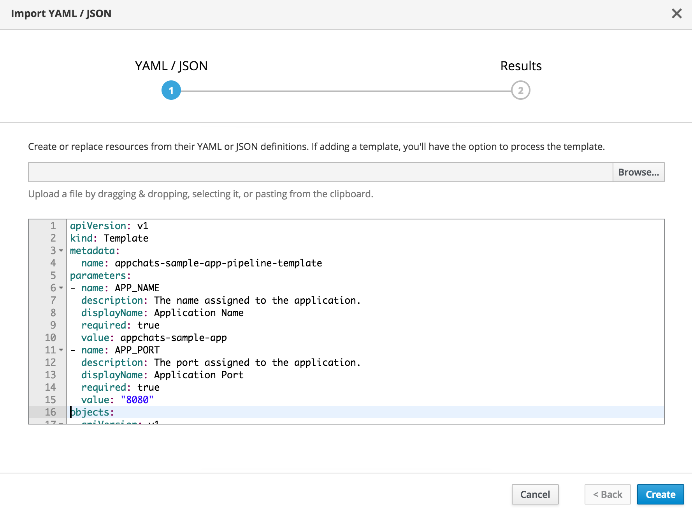
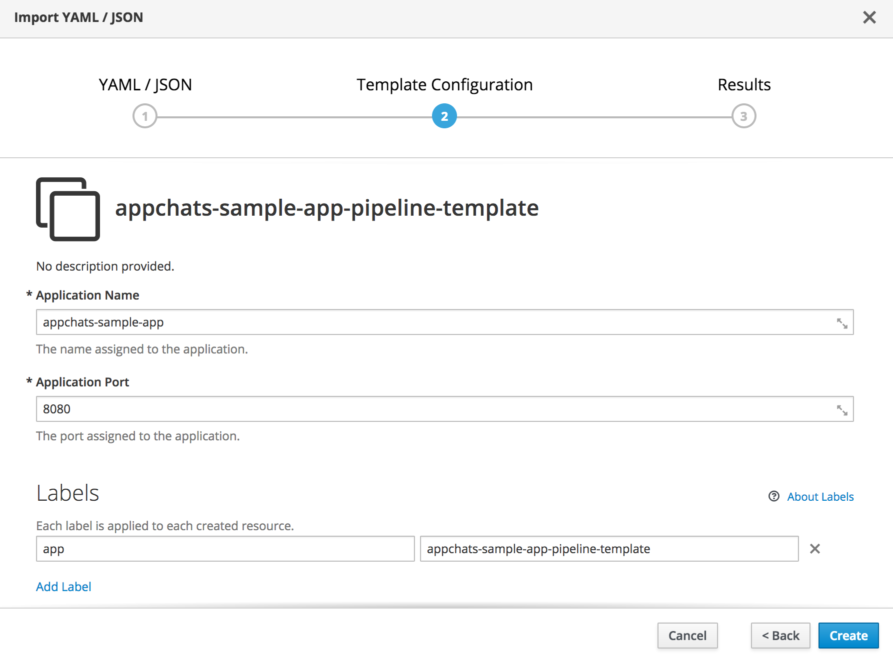
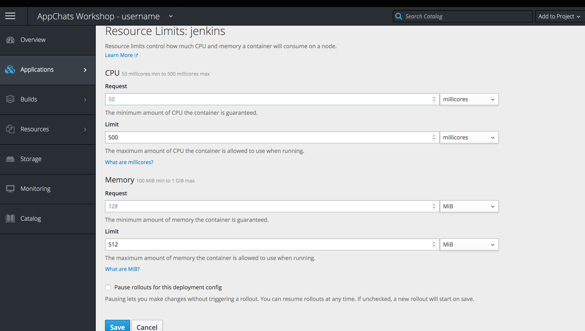
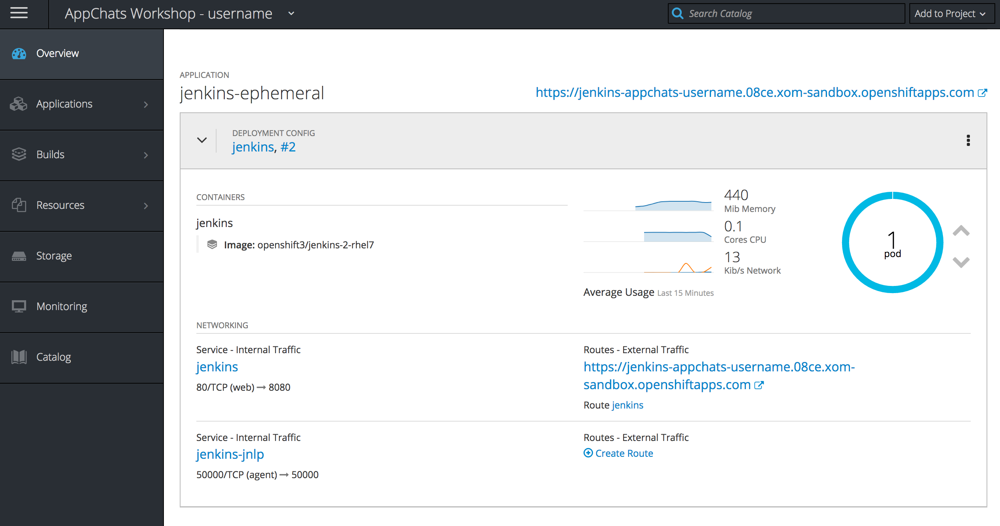
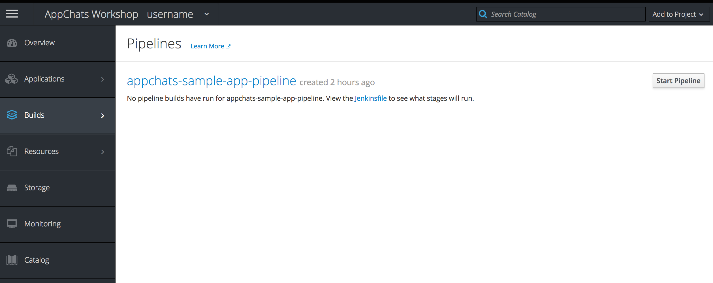
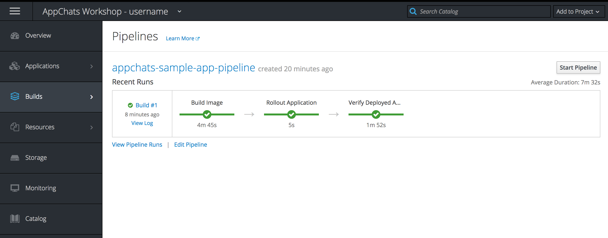
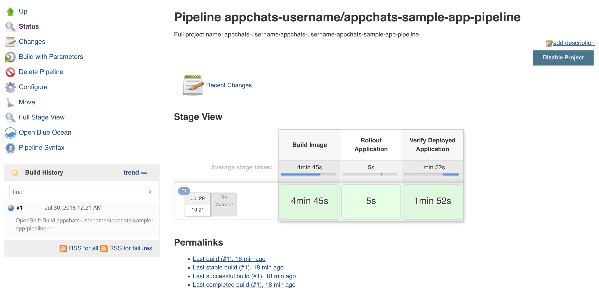

Exercise 8  - Continuous Integration and Continuous Delivery Using Jenkins
============================

In this exercise, you will create utilize several Continuous Integration and Continuous Delivery methodologies to build, deploy and verify the AppChats application using Pipelines as Code driven by the Jenkins Continuous Integration server. 

## Overview

To be successful in today's fast past IT industry, development teams need to be able to develop, test and deploy new features rapidly. These steps are typically follow a known repeatable process that can be easily modeled. To support the orchestration of these processes, a Continuous Integration server, such as [Jenkins](https://jenkins.io/) is utilized. Jenkins contains a feature known as _Pipelines_ which allows for users to declaratively define the entire software development lifecycle. The pipeline concept makes use of a file stored alongside the application source code or within Jenkins itself. A Jenkinsfile is an example of the Infrastructure as Code (IaC) concept where infrastructure related items are modeled within configuration files in a format that both developers and infrastructure personnel can understand. 

OpenShift supports the concept of Jenkins Pipeline as code through the _JenkinsPipeline_ build strategy. Recall in earlier exercises, the Source-to-Image build strategy was used. In addition to a strategy. OpenShift also features several deep integration with Jenkins including:

* Ability to deploy an instance of Jenkins on the platform through a [supported image](https://docs.openshift.com/container-platform/3.9/using_images/other_images/jenkins.html)
* Several Jenkins plugins
	* [OpenShift Sync Plugin](https://plugins.jenkins.io/openshift-sync) - Synchronize BuildConfig's defined within OpenShift to create Jenkins pipeline jobs
	* [OpenShift Client Plugin](https://plugins.jenkins.io/openshift-client) - Fluent DSL for integrating with OpenShift within Jenkins plugins.

Additional details regarding the integration between Jenkins pipelines and OpenShift can be found [here](https://docs.openshift.com/container-platform/3.9/dev_guide/openshift_pipeline.html).

## JenkinsPipeline BuildConfig

In an earlier exercise, when we instantiated the AppChats sample application, it created a BuildConfig leveraging the _Source_ build strategy. It provided the ability to take source code rom a Git repository and package it into a container image. To demonstrate how we can implement CI/CD using Jenkins pipelines, let's create another BuildConfig using the _JenkinsPipeline_ build strategy.

Unlike previously where we had OpenShift create the BuildConfig automatically, we will create the BuildConfig ourselves from an [OpenShift template](https://docs.openshift.com/container-platform/3.9/dev_guide/templates.html). A template describes a set of objects, such as BuildConfig's and DeploymentConfig's, that can be parameterized and processed to create objects within OpenShift. A template called `appchats-sample-app-pipeline-template.yml` is available and contains a _JenkinsPipeline_ BuildConfig and an inline pipeline to describe how to build, deploy and test the application.

Review the template file:

[appchats-sample-app-pipeline-template.yml](../../templates/appchats-sample-app-pipeline-template.yml) 

### Instantiate the Template

Using your web browser, instantiate the template by selecting the **Add to Project** dropdown on the top right hand side of the page and then select **Import YAML/JSON**. 

Copy and paste the contents of the [appchats-sample-app-pipeline-template.yml](../../templates/appchats-sample-app-pipeline-template.yml) template file into the textbox.

Click **Create**. When a template is added, you will have the ability to either process and/or add the template to the platform for use later. Make sure the **Process the Template** checkbox is checked and then click **Continue**.

Two parameters are defined within this template: The name of the application and the port that is exposed by the container. Leave the values as their defaults and click **Create**.

The result of the template instantiation will be shown. Click **Close** to complete the dialog. 

## Jenkins

When a _JenkinsPipeline_ BuildConfig is added to a project, an instance of Jenkins is automatically created. On the _Overview_ page, a new application called _jenkins-ephemeral_ should be deploying. Unfortunately, since Jenkins is automatically created, we did not have an opportunity to define the resources that it was able to consume. By default, it is given a low amount of resources which may degrade the overall performance. 

To modify the amount of resources Jenkins is able to utilize, go to the Jenkins deployment by hovering over **Applications**, selecting **Deployments** and then selecting **Jenkins**.

On the **Actions** dropdown on the top righthand side, select **Edit Resource Limits**

Set the CPU limits to **500 millicores**

 

Click **Save** to apply the changes. A new deployment of Jenkins will occur

Return to the _Overview_ page and wait for Jenkins to be ready as indicated by a dark blue circle with 1 running pod.

 

More information about resources and limits can be viewed after the workshop by reviewing the documentation for [Quotas and Limits](https://docs.openshift.com/container-platform/3.9/dev_guide/compute_resources.html).

## Executing the Pipeline

OpenShift has a page within the web console specifically for Pipelines. It can be accessed by Hovering over **Builds** and then **Pipelines**. 

 

As you can see a single pipeline is available called _appchats-sample-app-pipeline_. Click the **appchats-sample-app-pipeline** link and then the **Configuration** tab to review the contents of the pipeline.

The pipeline performs the following actions:

1. Builds an image by invoking the previously created BuildConfig using the Source-to-Image strategy
2. Rollout the newly created image
3. Perform a verification step confirming the application responds successfully to an HTTP request.

These actions are broken down into _stages_ as noted by the `stage('value')` within the pipeline. This allows us to break up the pipeline into logical steps. 

The OpenShift Client plugin is used throughout the pipeline to simplify the interaction with OpenShift. The plugin is used when invoking `openshift.withCluster()` where then invocations against the platform are performed.

To start a new pipeline build, select the **History Tab** and then click **Start Pipeline**

In a few moments, a new build will be started in OpenShift and trigger a new job within Jenkins. When the _JenkinsPipeline_ BuildConfig is created in OpenShift, an analogous job is created in Jenkins with the same name. 

Each stage will be depicted explicitly on the pipeline page along with the progress of the build.  

 

When the build completes, you can view the logs from the build within Jenkins. Select the **View Logs** button which will redirect you to the Jenkins instance. 

Jenkins is protected by the same authentication mechanism as OpenShift. Click on the **Login With OpenShift** button when presented which will use your GitLab credentials to automatically log you into Jenkins.

After reviewing the build logs, you can see the entire details of the job by clicking the **Back to Project** link at the top left corner of the page.

 

While this exercise provided a high level overview of the Pipelines functionality and integration between OpenShift and Jenkins, it provided the building blocks for creating complex Continuous Integration and Continuous Delivery implementations. 

[Exercise 7](../exercise7/README.md) | [Home](../README.md) | [Conclusion](../conclusion/README.md)
